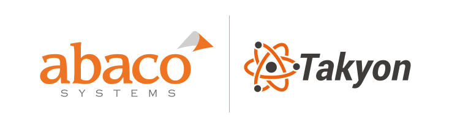

## License
  Copyright 2018 Abaco Systems
  Licensed under the Apache License, Version 2.0 (the "License");
  you may not use this file except in compliance with the License.
  You may obtain a copy of the License at
      http://www.apache.org/licenses/LICENSE-2.0
  Unless required by applicable law or agreed to in writing, software
  distributed under the License is distributed on an "AS IS" BASIS,
  WITHOUT WARRANTIES OR CONDITIONS OF ANY KIND, either express or implied.
  See the License for the specific language governing permissions and
  limitations under the License.

## About
Takyon is a high level, high speed, portable, reliable, dynamic, fully scalable, point to point, message passing, communication API. It's focused on the embedded HPC industry, with no intention to compete with MPI which is focused on the HPC industry. Like MPI, Takyon is designed to be a wrapper over many low level point to point communication APIs and look like a single high level message passing API. This is to provide an application with a one stop shop for all point to point message passing needs no mater the interconnect or locality (inter-thread, inter-process, inter-processor, intra-application, inter-application).

Takyon's mission statement: "<b>The flexibility and performance of low level. The simplicity of high level.</b>" 

For all the great details on Takyon, read the following PDFs in Takyon's `docs/` folder:
- Takyon Reference Sheet.pdf - All the details at a quick glance.
- Takyon Users Guide.pdf     - In depth details of the design and how to use the API.

This readme documents the supported operating systems and interconnects for Abaco's reference implementation of Takyon. It provides instructions on how to build the libraries and the examples. Refer to the example specific readme files to determine how to run each example.

## Supported OSes
### Linux
- Tested on Ubuntu 16.04 64-bit Intel using gcc, but should work on most other Linux flavors and chip architectures.
- All interconnects are supported
### Mac
- Tested on OSX 10.13 64-bit using gcc
- All interconnects are supported
### Windows
- Tested on Window 10 64-bit using MSVC 2015
- All interconnects are supported

## Build Instructions
### Linux
```
> cd Takyon/API/builds/linux_intel_64bit
> make
```
This creates:
```
libTakyon.a
libTakyonMemcpy.so
libTakyonMmap.so
libTakyonSocket.so
```
### Mac OSX
```
> cd Takyon/API/builds/mac_intel_64bit
> make
```
This creates:
```
libTakyon.a
libTakyonMemcpy.so
libTakyonMmap.so
libTakyonSocket.so
```
### Windows
```
> cd Takyon\API\builds\windows_intel_64bit
> nmake
```
This creates:
- Takyon.lib

## Preparing to Run Examples
### Linux
```
> export TAKYON_LIBS="<Takyon_parent_folder>/Takyon/API/builds/linux_intel_64bit"
```
### Mac OSX
```
> export TAKYON_LIBS="<Takyon_parent_folder>/Takyon/API/builds/mac_intel_64bit"
```
### Windows
All features are encapsulated in the static library Takyon.lib, so no environment variable is needed.

## Supported Interconnects
This reference implementation supports commonly used mechanisms for inter-thread, inter-process and inter-processor communication. Abaco's upcoming commercial implementation will support additional inter-processor and GPU communication protocols including RDMA and GPU IPC.

### Memcpy
- Endpoints must be in the same process but different threads.
- Uses Posix mutexes and conditional variables to handle atomic coordination.
- Application can optionally pass in sender and/or receiver memory, otherwise it will be allocated by Takyon.
- If `-share` option is used:
  - Both endpoints will share the memory buffers for a particular direction (`AtoB` and `BtoA` are different directions). This is an advanced feature.
  - Application can optionally pass in sender or receiver memory (but not both), otherwise it will be allocated by Takyon.
### Mmap
- Endpoints must be in the same OS but different processes.
- Uses Posix memory map for data memory that is accessible between processes.
- On unix, uses process shared Posix mutexes and conditional variables to handle atomic coordination. On Windows, uses processed based Mutex and Events.
- Uses local sockets for connecting, disconnecting, and detecting disconnections.
- Application can optionally pass in sender memory, otherwise it will be allocated by Takyon.
- Application can optionally pass in pre-allocated named memory maps, otherwise it will be allocated by Takyon. In order to allow this, the interconnect flag `-app_alloced_recv_mem` must be set on the endpoint that allocates the named memory maps. The remote endpoint must then set the flag `-remote_mmap_prefix <prefix-name>`, where `<prefix-name><buffer_index>` is the name used when the memory mapped buffers were created. This is helpful when multiple communication paths are used to gather data into a contiguous buffer.
- If `-share` option is used:
  - Both endpoints will share the memory buffers for a particular direction (`AtoB` and `BtoA` are different directions). This is an advanced feature.
### Socket
- Endpoints can be in the same OS or different OSes, but in the same IP network.
- Can use local sockets (if in the same OS only) or TCP sockets. If using local sockets, on Linux and Mac, it will use a local Unix socket which will have better performance than using a TCP socket with IP address 127.0.0.1. On Windows it uses 127.0.0.1 with a TCP connection since local Unix sockets do not exist on Windows.
- The socket option "TCP No delay" is turned on to improve latency.
- If polling is used (i.e. `attrs.is_polling = true`), sockets do not require both endpoints to be polling.

## Interconnect Specifications
These are the text strings passed into `attributes->interconnect[]`
### Specifications
- Inter-thread (endpoints in the same process)
`Memcpy -ID <ID> [-share]`
- Inter-process (endpoints in the same OS)
`Mmap -ID <ID> [-share] [-app_alloced_recv_mem] [-remote_mmap_prefix <name>]`
`Socket -local -ID <ID>`
`Socket -remoteIP 127.0.0.1 -port <port>`
`Socket -localIP 127.0.0.1 -port <port>`
`Socket -localIP Any -port <port>`
- Inter-processor (endpoints not in the same OS)
`Socket -remoteIP <IP> -port <port>`
`Socket -localIP <IP> -port <port>`
`Socket -localIP Any -port <port>`
### Parameter Descriptions
- `-ID <ID>`
Can be any integer
- `-share`
Sender and receiver share the same buffers. Don't put data in the sender buffer until the receiver is done processing on the buffer.
- `-app_alloced_recv_mem`
Informs the path that all of the receive buffers where allocated by the application using a named memory map.
- `-remote_mmap_prefix <name>`
If the remote endpoint is using an application allocated named memory map for the buffers, this defines the name used to create the memory maps.
- `-local`
Uses a Unix local socket which is better performance due to avoid some of the TCP stack
- `-remoteIP 127.0.0.1`
The client side of the connection. 127.0.0.1 is a special loop back address used to keep communication local (in the same OS). This uses the full TCP stack so it's not as efficient as using `-local`.
- `-localIP 127.0.0.1`
The server side of the loop back connection.
- `-port <port>`
Use a valid port number not being blocked by a firewall and not used by another service. This must be the same on both endpoints.
- `-remoteIP <IP>`
The client side of the TCP connection. The IP address must be the same as the server side (`-localIP` side).
- `-localIP <IP>`
The server side of the TCP connection. The IP address must be the same as the client side (`-remoteIP` side).
- `-localIP Any`
The server side of the TCP connection. This allows the connection to occur on any IP interface that is listening on the specified port number. Since the client side must specify an IP address, this inherently defines the IP interface that will be used on the server side. Be careful to avoid multiple interfaces using the same port number.

## Application Header Files
These will be needed by Takyon applications:
- Core APIs: `Takyon/API/inc/takyon.h`
- Utility APIs: `Takyon/utils/takyon_utils.h`

## Running the Examples
- The examples are found in `Takyon/examples/`
- Each example has a `README.txt` which explains what is does and how to build and run.


## The Evolution of Takyon
The Takyon API was formulated by Michael Both after about 20 years of challenging experiences with communication APIs for heterogeneous compute architectures in the embedded HPC industry. He implemented applications using many standard communication APIs (Socket, MPI, Verbs, Network Direct, named memory map, message queue, semaphore, mutex, cond var, memcpy, corba), many company proprietary APIs (Abaco, Mercury, Ixthos, Texas Instruments, Sparc, Sky Computers, Radstone Technologies, Google, Apple), and on many different architectures (Sparc, PPC, Sharc, TI, Intel, Arm, iOS, Android). In addition to using all these communication APIs, he also implemented one high level open standard (Abaco's MPI 1.x) and two high level proprietary APIs (Lockheed Martin's GEDAE and Abaco's AXIS Flow). This vast experience gave a great insight into the strengths and weaknesses of each communication API. One API did not fit all the needs of the common embedded HPC application, and it became clear that a better standard was needed for this audience. Khronos was first approached in 2017 to see if Takyon should become an open standard. In 2018 Khronos decided to create an exploratory group to determine industry interest.
